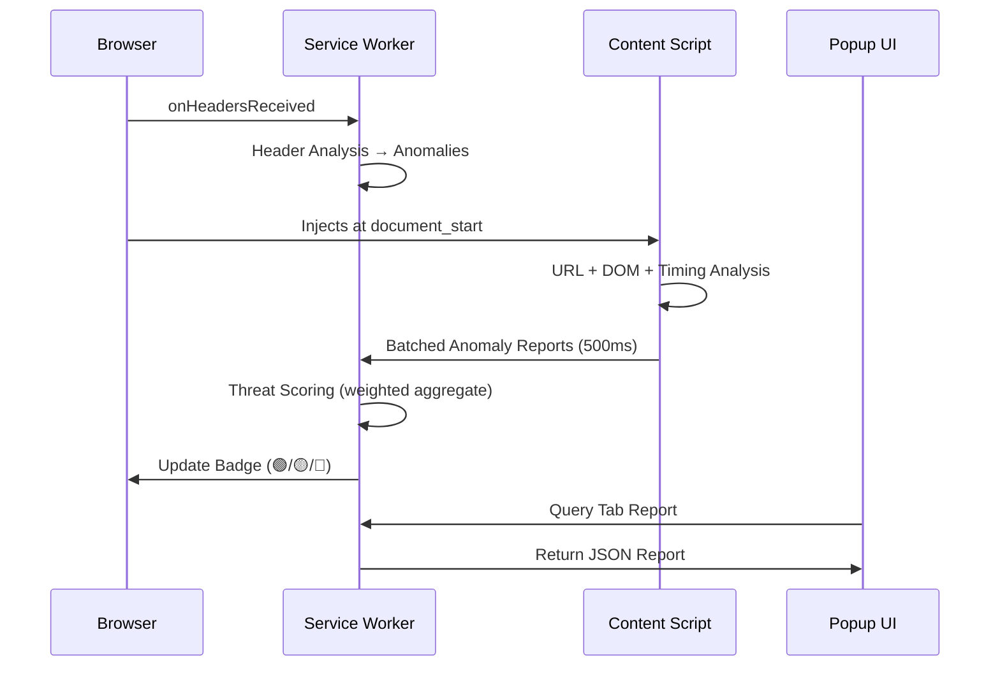

<p align="center">
  
</p>

<h1 align="center">AiTM Proxy Fingerprint Detector</h1>

<p align="center">
  <strong>Real-time browser defense against Adversary-in-the-Middle reverse proxy phishing attacks</strong>
</p>

<p align="center">
  
  
  
  
  
</p>

---

## 🛡️ What Is This?

AiTM (Adversary-in-the-Middle) phishing toolkits like **Evilginx**, **Modlishka**, and **Muraena** operate as transparent reverse proxies between the victim and legitimate identity providers. They intercept credentials *and* session cookies in real time—**effectively bypassing Multi-Factor Authentication (MFA)**.

This Chrome extension detects the subtle fingerprints these proxies leave behind by combining **five independent detection modules** into a unified, weighted threat score—all running entirely within your browser with zero external data transmission.

---

## ✨ Key Features

| Feature | Description |
|---------|-------------|
| 🔍 **HTTP Header Analysis** | Detects missing security headers, proxy leak headers (`Via`, `X-Forwarded-For`), server mismatches, and cookie domain rewriting |
| 🌐 **URL Structure Analysis** | Flags subdomain concatenation attacks (Evilginx signature), suspicious TLDs, and toolkit-specific lure tokens |
| 🧬 **DOM Fingerprinting** | Identifies visual spoofing of IdP login pages, resource bleed-through, SRI stripping, and known toolkit DOM injections |
| ⏱️ **Network Timing Analysis** | Detects TTFB asymmetry (fast connect + slow response = relay) and HTTP/2→HTTP/1.1 protocol downgrades |
| 🏷️ **Domain Reputation** | Scores suspicious TLDs, typosquatting patterns, excessive subdomain depth, and punycode/IDN homoglyphs |
| 🎯 **Toolkit Signatures** | Recognizes patterns specific to Evilginx, Modlishka, and Muraena |
| 🔒 **100% Local** | All analysis happens client-side—no data ever leaves your browser |

---

## 🚦 Threat Classification

The extension uses a color-coded traffic light system on the toolbar badge:

| Badge | Score | Classification | Meaning |
|-------|-------|----------------|---------|
| 🟢 | 0–25 | **SAFE** | No proxy indicators detected |
| 🟡 | 26–60 | **SUSPICIOUS** | Unusual signals found—exercise caution |
| 🔴 | 61–100 | **DANGEROUS** | Strong AiTM proxy indicators—**do NOT enter credentials** |

---

## 🏗️ Architecture

```
AiTM/
├── manifest.json                    # Chrome MV3 extension manifest
├── assets/                          # Extension icons (16/48/128px)
├── background/
│   ├── service-worker.js            # Central orchestrator & state manager
│   ├── header-analyzer.js           # HTTP response header inspection
│   └── threat-scorer.js             # Weighted heuristic scoring engine
├── content/
│   ├── detector.js                  # In-page scanner (URL, DOM, timing)
│   └── idp-signatures.js            # IdP fingerprints & toolkit signatures
├── popup/
│   ├── popup.html                   # Extension popup UI
│   ├── popup.css                    # Popup styles
│   └── popup.js                     # Popup logic & rendering
├── shared/
│   └── constants.js                 # Enums, thresholds, weights, config
└── docs/
    ├── TECHNICAL_DOCUMENTATION.md   # In-depth technical reference
    └── USER_GUIDE.md                # Non-technical user guide
```

### Data Flow



---

## 💿 Installation

### From Source (Developer Mode)

1. **Clone** this repository:
   ```bash
   git clone https://github.com/bimstack/AiTM-Proxy-Finger-Print-Detector-Browser-Extention-.git
   cd AiTM-Proxy-Finger-Print-Detector-Browser-Extention-
   ```

2. Open Chrome and navigate to `chrome://extensions`

3. Enable **Developer mode** (toggle in the top-right corner)

4. Click **Load unpacked** and select the `AiTM` folder

5. Pin the shield icon in your toolbar for easy access

> **Note:** Requires Chrome **≥116** (Manifest V3 baseline).

---

## 🔬 Detection Methodology

### Scoring Engine

Each detection module contributes to a weighted threat score (0–100):

| Module | Weight | What It Catches |
|--------|--------|-----------------|
| HTTP Headers | **25%** | Missing CSP/HSTS, proxy leak headers, server mismatches, cookie rewriting |
| URL Structure | **25%** | Embedded IdP domains, suspicious TLDs, Evilginx lure tokens |
| DOM Fingerprint | **25%** | Visual spoofing, resource bleed-through, SRI stripping, toolkit artifacts |
| Network Timing | **15%** | TTFB relay asymmetry, protocol downgrades |
| Domain Reputation | **10%** | Disposable TLDs, typosquatting, IDN homoglyphs |

### Severity Levels

| Severity | Points | Example |
|----------|--------|---------|
| 🔴 CRITICAL | 40 | IdP domain embedded as subdomain, proxy header leak |
| 🟠 HIGH | 25 | Missing HSTS, server mismatch (nginx on "Microsoft" page) |
| 🟡 MEDIUM | 15 | Missing CSP, suspicious timing patterns |
| ⚪ LOW | 8 | Minor domain reputation flags |

### Supported Identity Providers

- **Microsoft Entra / Office 365** — `login.microsoftonline.com`, `login.microsoft.com`, `login.live.com`
- **Google Workspace** — `accounts.google.com`, `myaccount.google.com`
- **Okta** — `okta.com`, `oktapreview.com`
- **GitHub** — `github.com`

### Recognized AiTM Toolkits

- **Evilginx** — URL lure patterns, DOM artifacts, SRI stripping
- **Modlishka** — Tracking tokens, Go HTTP client fingerprints
- **Muraena** — Necrobrowser beacons, DOM injection patterns

---

## ⚡ Performance

The extension is designed to have near-zero impact on browsing performance:

- **Debounced DOM scanning** — MutationObserver throttled to 200ms intervals
- **Batched message passing** — Anomalies buffered and sent every 500ms
- **Throttled storage writes** — Max 1 write/second/tab
- **Early exit** — Verified IdP domains skip deep inspection entirely
- **Automatic cleanup** — Tab state purged on close; event log capped at 500 entries (FIFO)

---

## 🔐 Permissions

| Permission | Why It's Needed |
|------------|-----------------|
| `webRequest` | Observe HTTP response headers for proxy fingerprints |
| `storage` | Persist threat reports and event history locally |
| `tabs` | Query active tab for popup ↔ background communication |
| `webNavigation` | Reset state on navigation to prevent false positives |
| `alarms` | Schedule periodic cleanup of stale data |
| `<all_urls>` | Monitor all domains (phishing infrastructure is unpredictable) |

---

## ⚠️ Known Limitations

- **No TLS/Certificate Inspection** — Chrome MV3 does not expose certificate details to extensions
- **Ephemeral Service Worker** — MV3 workers can be terminated by Chrome at any time; state is persisted to `chrome.storage.local`
- **Cross-Origin Timing Restrictions** — `PerformanceNavigationTiming` precision is limited by `Timing-Allow-Origin` headers
- **Isolated Content Script World** — Cannot intercept `fetch`/`XHR` without `MAIN` world injection

---

## 🗺️ Roadmap

- [ ] Firefox port with `browser.webRequest.getSecurityInfo()` for TLS certificate analysis
- [ ] Native Messaging Host for system-level TLS inspection
- [ ] Cloud Certificate Transparency log verification
- [ ] WHOIS/RDAP domain age lookups
- [ ] Enterprise managed policy support for custom IdP signatures
- [ ] Threat intelligence feed integration

---

## 📖 Documentation

- [**Technical Documentation**](docs/TECHNICAL_DOCUMENTATION.md) — Architecture deep-dive, scoring engine internals, message protocol schemas
- [**User Guide**](docs/USER_GUIDE.md) — Non-technical guide covering installation, usage, and what alerts mean

---

## 🤝 Contributing

Contributions are welcome! If you'd like to improve the extension:

1. Fork this repository
2. Create a feature branch (`git checkout -b feature/my-improvement`)
3. Commit your changes (`git commit -m "Add: description of change"`)
4. Push to your branch (`git push origin feature/my-improvement`)
5. Open a Pull Request

---

<p align="center">
  <sub>Built to defend against the evolving threat of AiTM phishing. Stay safe. 🛡️</sub>
</p>
