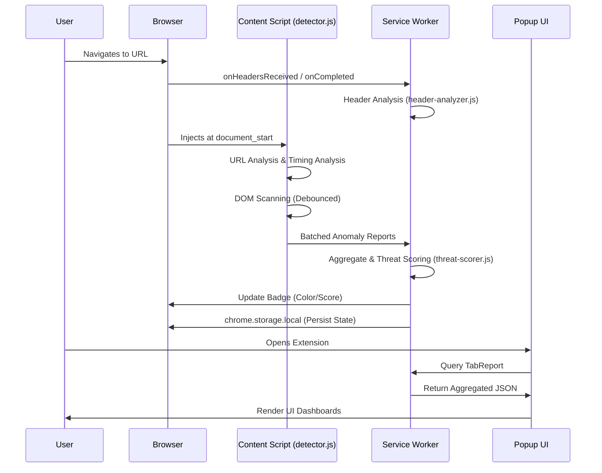

# AiTM Proxy Fingerprint Detector: Technical Documentation

## Table of Contents

1. [Project Overview](#1-project-overview)
2. [System Architecture](#2-system-architecture)
    - [High-Level Data Flow](#21-high-level-data-flow)
    - [Core Components](#22-core-components)
3. [Detection Modules Detail](#3-detection-modules-detail)
    - [HTTP Header Analysis](#31-http-header-analysis)
    - [URL Structure Analysis](#32-url-structure-analysis)
    - [DOM Fingerprint Analysis](#33-dom-fingerprint-analysis)
    - [Network Timing Analysis](#34-network-timing-analysis)
    - [Domain Reputation Analysis](#35-domain-reputation-analysis)
4. [Threat Scoring Engine](#4-threat-scoring-engine)
5. [Message Passing Protocol](#5-message-passing-protocol)
6. [API Permissions & Security Model](#6-api-permissions--security-model)
7. [Performance Optimizations](#7-performance-optimizations)
8. [Known Limitations](#8-known-limitations)
9. [Future Enhancements](#9-future-enhancements)

---

## 1. Project Overview

The **AiTM Proxy Fingerprint Detector** is a Google Chrome Manifest V3 (MV3) browser extension designed to detect Adversary-in-the-Middle (AiTM) reverse proxy phishing attacks in real-time. 

Unlike traditional credential harvesting phishing sites, AiTM toolkits (such as Evilginx2, Evilginx3, Modlishka, and Muraena) operate as automated, transparent reverse proxies situated between the victim and legitimate Identity Providers (IdPs) like Microsoft Entra/Office 365, Google Workspace, and Okta. These toolkits dynamically proxy authentication requests, capture credentials in transit, and most critically, intercept session cookies, thereby effectively bypassing Multi-Factor Authentication (MFA).

This extension employs a multi-layered heuristic approach, combining passive network observation, DOM introspection, and timing analysis to identify the subtle fingerprints left by these proxying toolkits.

---

## 2. System Architecture

The extension is built on the Chrome MV3 architecture, separating concerns across background service workers, content scripts, and presentation layers.

### 2.1 High-Level Data Flow



### 2.2 Core Components

#### 1. Background Service Worker (`background/service-worker.js`)
- **Role:** Central orchestrator and state manager.
- **Characteristics:** Ephemeral, event-driven MV3 service worker.
- **Responsibilities:**
  - Registers `chrome.webRequest.onHeadersReceived` and `chrome.webRequest.onCompleted` listeners to intercept HTTP metadata.
  - Receives and deserializes anomaly reports from content scripts via `chrome.runtime.onMessage`.
  - Routes data to the Threat Scorer.
  - Updates extension action badges (e.g., Red for Critical).
  - Persists aggregated events and tab states to `chrome.storage.local`.

#### 2. Header Analyzer Module (`background/header-analyzer.js`)
- **Role:** Network metadata inspector.
- **Responsibilities:** Analyzes HTTP response headers for proxy indicators.
- **Checks Performed:** 
  - Missing security headers (CSP, HSTS, X-Frame-Options).
  - Presence of proxy leak headers (Via, X-Forwarded-For).
  - Server header mismatches against expected IdP infrastructure.
  - Set-Cookie domain rewriting validation.

#### 3. Threat Scorer (`background/threat-scorer.js`)
- **Role:** Heuristic evaluation engine.
- **Responsibilities:** Aggregates anomalies per-tab and applies a weighted scoring algorithm to determine the final threat classification.

#### 4. Content Script (`content/detector.js`)
- **Role:** In-page active scanner.
- **Characteristics:** Injected at `document_start` on all frames (`<all_urls>`).
- **Responsibilities:**
  - URL Structure Analysis.
  - DOM Fingerprinting (Visual spoofing, SRI stripping, bleed-through).
  - Network Timing Analysis via `PerformanceNavigationTiming`.
  - Subscribes to `MutationObserver` for Single Page Application (SPA) support.
  - Employs debouncing (200ms) and batching (500ms) to minimize performance overhead.

#### 5. IdP Signature Database (`content/idp-signatures.js`)
- **Role:** Static definitions and heuristics.
- **Responsibilities:** Maintains fingerprints for Microsoft Entra, Google Workspace, Okta, and GitHub. Includes known AiTM toolkit signatures (e.g., Evilginx lure patterns).

#### 6. Shared Constants (`shared/constants.js`)
- **Role:** Configuration management.
- **Responsibilities:** Stores enums, thresholds, weight configurations, and the suspicious TLD list.

#### 7. Popup UI (`popup/`)
- **Role:** User interface and diagnostics.
- **Responsibilities:** Displays threat score gauges, module breakdown bars, and anomaly event timelines. Queries the background worker for real-time per-tab reports.

---

## 3. Detection Modules Detail

### 3.1 HTTP Header Analysis
AiTM proxies often fail to perfectly replicate the HTTP header posture of the upstream IdP.

- **Missing Security Headers:** Flags instances when `Content-Security-Policy` (CSP), `Strict-Transport-Security` (HSTS), `X-Frame-Options`, or `X-Content-Type-Options` are absent on login-like pages. Proxies strip these to permit script injection and framing.
- **Proxy Leak Headers:** Detects headers that reverse proxies inadvertently expose or append, such as `Via`, `X-Forwarded-For`, `X-Forwarded-Proto`, `X-Real-IP`, and `Forwarded`.
- **Server Header Mismatch:** Compares the `Server` response header against expected IdP values. For instance, Microsoft uses `Microsoft-IIS` or `Microsoft-HTTPAPI`, while Google uses `ESF`, `GSE`, or `gws`. Observing `nginx`, `openresty`, or `apache` on a supposed IdP domain is a high-confidence indicator.
- **Cookie Domain Rewriting:** Detects when `Set-Cookie` domain attributes have been altered by the proxy to match the phishing domain rather than the expected IdP root domain.

### 3.2 URL Structure Analysis
AiTM deployments often rely on specific URL routing mechanics.

- **Subdomain Concatenation:** A primary Evilginx signature pattern where legitimate domains are embedded as subdomains to trick users. Example: `login.microsoftonline.com.attacker-domain.xyz`.
- **Suspicious TLD:** Flags disposable or cheap Top-Level Domains commonly used for ephemeral phishing infrastructure: `.xyz`, `.top`, `.click`, `.live`, `.cfd`, `.rest`, `.buzz`, `.surf`, `.icu`, `.cyou`.
- **Lure Token Detection:** Utilizes regex patterns to identify Evilginx lure keys (e.g., `?key=`, `?lure=`) and Modlishka tracking tokens (e.g., `?ident=`).

### 3.3 DOM Fingerprint Analysis
Evaluates the rendered document and its resources.

- **Visual Spoof Detection:** Scans page text for IdP-specific visual markers (e.g., "Sign in to your account" for Microsoft) when the hostname does not match the authoritative IdP domain.
- **Bleed-Through Detection:** Identifies when a page loads scripts, stylesheets, or images directly from authentic IdP origins while hosted on a third-party domain. This indicates a proxy that failed to rewrite 100% of resource URLs.
- **SRI Stripping:** AiTM proxies must remove Subresource Integrity (`integrity`) attributes from `<script>` and `<link>` tags to prevent browsers from rejecting maliciously modified resources. The module flags pages with numerous external scripts missing expected integrity attributes.
- **Form Action Analysis:** Checks if `<form action="...">` URLs point to unexpected, non-IdP domains.
- **Toolkit Artifact Detection:** Scans the DOM for known injection patterns, such as Muraena's Necrobrowser beacons or Evilginx navigation hooks.

### 3.4 Network Timing Analysis
Exploits the physical reality of proxy routing.

- **TTFB Asymmetry:** Normal CDN-backed IdP connections exhibit moderate connection times and fast Time-to-First-Byte (TTFB). AiTM proxies often show ultra-fast connection times (< 25ms to a nearby VPS) but slow TTFB (> 400ms) as the proxy relays the request upstream. 
  - *Heuristic Formula:* `IF connectTime < 25ms AND TTFB > 400ms THEN FLAG_RELAY_INDICATOR`
- **Protocol Downgrade:** Expected `h2` or `h3` protocols but received `http/1.1` via `nextHopProtocol` in the Navigation Timing API. This indicates an intermediary proxy that does not support modern multiplexed protocols.

### 3.5 Domain Reputation Analysis
- **Suspicious TLD Scoring:** Applies baseline suspicion points for domains hosted on known disposable TLDs.
- **Domain Pattern Analysis:** Evaluates string entropy, looks for look-alike patterns (typosquatting), excessive subdomain depth (more than 3 levels), and IDN homoglyph indicators (punycode `xn--`).

---

## 4. Threat Scoring Engine

The `Threat Scorer` aggregates anomalies and applies a weighted mathematical model to generate a normalized score from 0 to 100.

### Weight Configuration
- HTTP Headers: `0.25`
- URL Structure: `0.25`
- DOM Fingerprint: `0.25`
- Timing Analysis: `0.15`
- Domain Reputation: `0.10`

### Severity Point Values (Pre-Weight)
- **CRITICAL:** 40 points
- **HIGH:** 25 points
- **MEDIUM:** 15 points
- **LOW:** 8 points

### Classification Thresholds
| Score Range | Classification | Action | Badge Color |
|-------------|----------------|--------|-------------|
| 0 - 25      | SAFE           | None   | Green       |
| 26 - 60     | SUSPICIOUS     | Warn   | Yellow/Orange|
| 61 - 100    | DANGEROUS      | Alert  | Red         |

---

## 5. Message Passing Protocol

Due to the isolated nature of MV3 components, robust message passing is critical. 

### Message Types
1. `ANOMALY_REPORT`: Content script -> Background. Submits detected anomalies.
2. `QUERY_TAB_REPORT`: Popup -> Background. Requests current state for the active tab.
3. `FORCE_RESCAN`: Popup -> Content Script. User-initiated DOM rescan.

### TabReport Schema
The central data structure maintained in the Background Service Worker per tab:

```typescript
interface TabReport {
  tabId: number;
  url: string;
  timestamp: number;
  score: number;
  classification: 'SAFE' | 'SUSPICIOUS' | 'DANGEROUS';
  modules: {
    headers: Anomaly[];
    urlStructure: Anomaly[];
    domFingerprint: Anomaly[];
    timing: Anomaly[];
    domainReputation: Anomaly[];
  };
  metrics: {
    connectTimeMs: number;
    ttfbMs: number;
    protocol: string;
  };
}

interface Anomaly {
  id: string;
  severity: 'LOW' | 'MEDIUM' | 'HIGH' | 'CRITICAL';
  description: string;
  evidence: string; // e.g., "Server header was 'nginx', expected 'Microsoft-IIS'"
  timestamp: number;
}
```

---

## 6. API Permissions & Security Model

The extension requests the following permissions in `manifest.json`:

- `"webRequest"`: Required for observational access to HTTP lifecycle events (`onHeadersReceived`). Crucial for Header Analysis.
- `"storage"`: Used to persist threat events, historical data, and user settings to `chrome.storage.local`.
- `"tabs"`: Required to query the active tab ID for popup-to-background communication and badge updating.
- `"webNavigation"`: Used to detect root navigation events in order to reset per-tab anomaly state and prevent false positives across navigations.
- `"alarms"`: Schedules periodic background tasks for cleanup of stale tab data and event logs.
- `"host_permissions": ["<all_urls>"]`: Absolutely necessary to observe network traffic and inject the content script across all domains to detect unknown phishing infrastructure.

---

## 7. Performance Optimizations

To ensure the extension does not degrade browser performance:

1. **Debounced DOM Scanning:** The DOM MutationObserver triggers a scan no more frequently than once every 200ms to avoid layout thrashing during heavy SPA renders.
2. **Batched Anomaly Reporting:** Anomalies detected by the content script are accumulated in a buffer and sent to the background worker every 500ms, minimizing inter-process communication overhead.
3. **Throttled Storage Writes:** Writes to `chrome.storage.local` are throttled to a maximum of 1 write per second per tab to avoid hitting MV3 quota limits.
4. **Targeted Observers:** `MutationObserver` is configured with `subtree: false` where deep inspection is not required.
5. **Early Exit:** Domains explicitly verified as legitimate (e.g., matching exact IdP signatures without any proxy indicators) bypass deep DOM inspection.
6. **State Cleanup:** Tab states are immediately purged from memory and storage upon `chrome.tabs.onRemoved` or cross-origin `webNavigation` events.
7. **Log Rotation:** The persistent event log in storage is capped at 500 entries using a strict FIFO eviction policy.

---

## 8. Known Limitations

- **TLS/Certificate Inspection:** Chrome MV3 APIs do not expose TLS certificate details, cipher suites, or Certificate Transparency (CT) status to extensions. Full TLS inspection requires Firefox's `browser.webRequest.getSecurityInfo()` API or the implementation of a Native Messaging Host.
- **Ephemeral Background Context:** MV3 service workers are ephemeral and can be terminated by the browser at any time. All critical state must be synchronously flushed to `chrome.storage.local`.
- **Network Interception:** Content scripts run in isolated worlds. They cannot intercept `fetch` or `XMLHttpRequest` directly without injecting scripts into the `MAIN` world, which introduces security risks and is avoided.
- **Cross-Origin Timing:** Cross-origin timing data provided by the `PerformanceNavigationTiming` API is restricted by `Timing-Allow-Origin` headers, sometimes limiting the precision of the network timing module.

---

## 9. Future Enhancements

- **Firefox Native Port:** Develop a Firefox-specific build leveraging `browser.webRequest.getSecurityInfo()` to analyze certificate issuers, SANs, and validity periods for immediate proxy detection.
- **Native Messaging Host:** Implement a companion desktop application communicating via Native Messaging to provide system-level TLS inspection capabilities on Chrome.
- **Cloud CT Log Verification:** Integrate with a backend service to perform real-time Certificate Transparency log lookups on suspicious domains.
- **WHOIS/RDAP Integration:** Add domain age lookups; domains registered within the last 30 days heavily correlate with phishing infrastructure.
- **Enterprise Configuration:** Allow enterprise administrators to deploy custom IdP signatures and whitelist internal reverse proxies via managed extension policies.
- **Threat Intelligence Feed:** Integrate with a remote C2 to pull real-time hashes and known Evilginx infrastructure IPs.

---
*End of Document*
